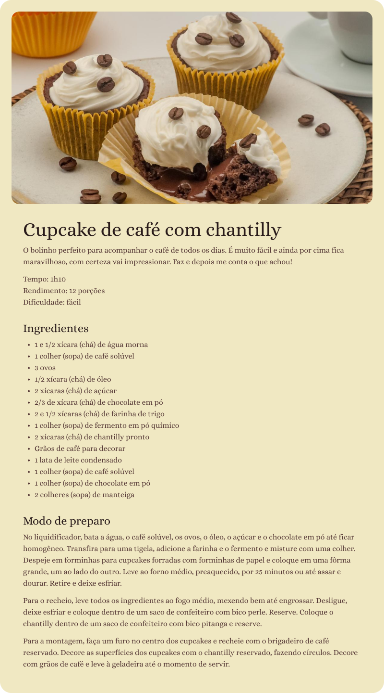

# Página de receitas

> Uma página de portfólio desenvolvida com HTML e CSS, como parte da prática do MBA Full-Stack RocketSeat e Sirius.

## Sobre o Projeto

Projeto tem como objetivo reproduzir o aprendizado do MBA, fazendo pequenas melhorias com fins de aprendizado.

## Funcionalidades

- Design responsivo
- Estrutura HTML semântica

## Tecnologias

- HTML5: Estrutura da página
- CSS3: Estilos, layout e responsividade

## Pattern

- BEM (Block, Element, Modifier)

## Preview do Projeto

